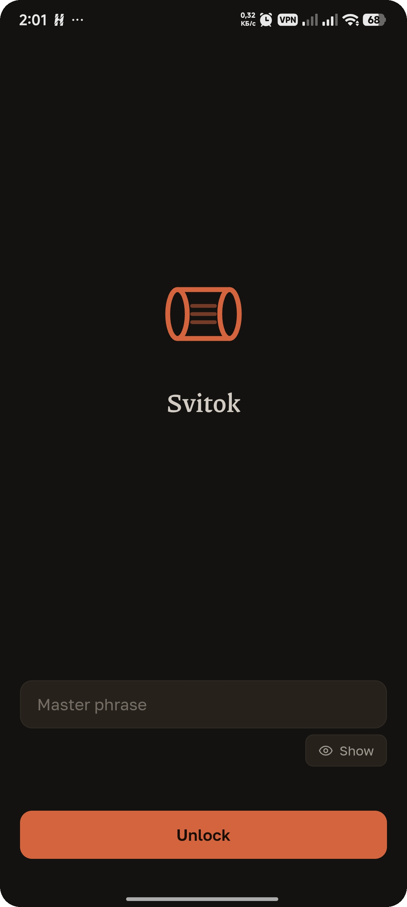
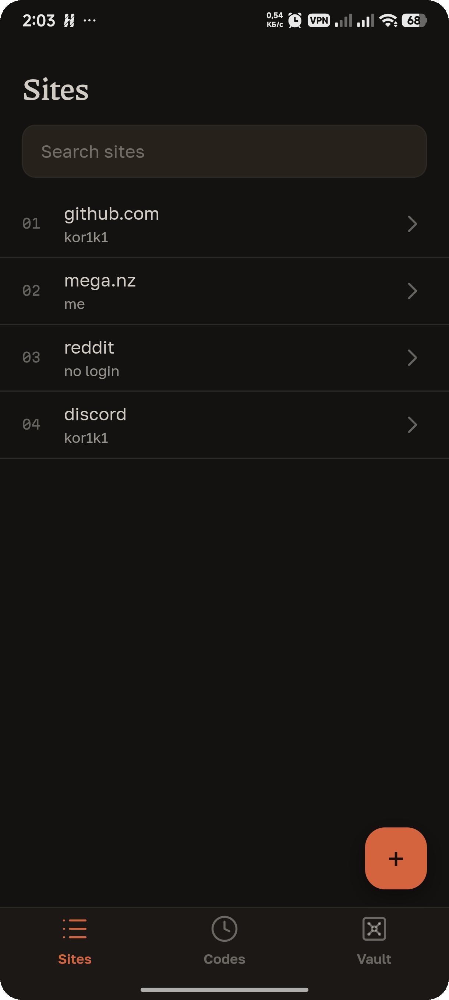
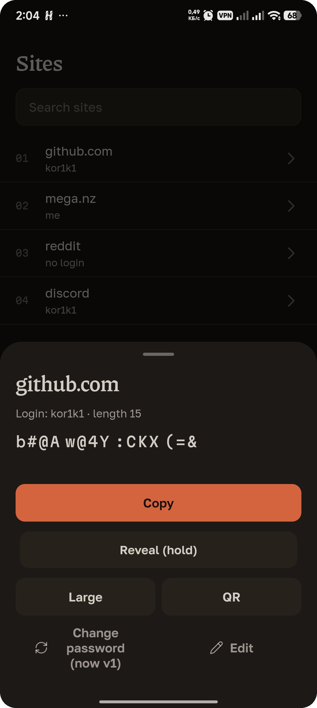
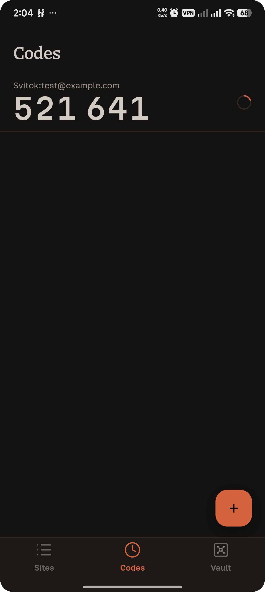
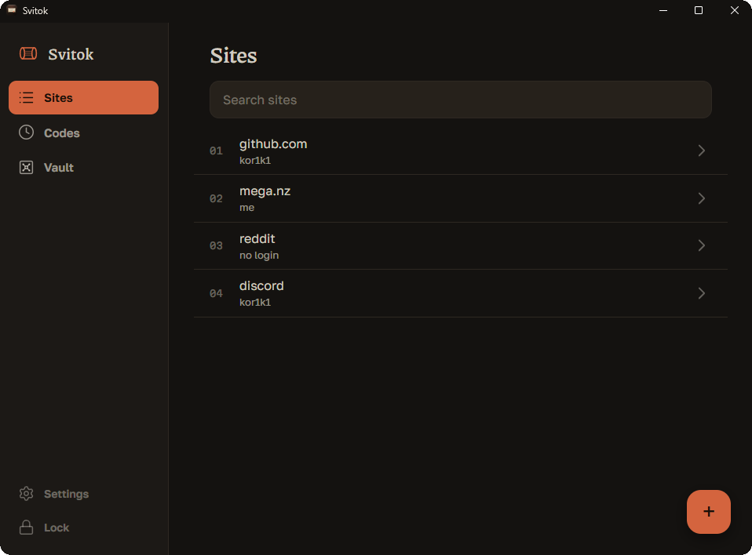

<div align="center">


# Svitok

**A paper-first, offline, deterministic password manager.**
Your passwords aren't stored anywhere. They're recomputed from a random seed on paper and a phrase in your head.

[](LICENSE)

[](https://github.com/KOR1K1/svitok/releases)


</div>

Svitok (Russian *свиток*, "scroll") came out of a simple, annoying event: a password got dumped in a breach, and it turned out the same password with tiny variations had been reused for years. The usual fix is a vault app that stores everything encrypted in the cloud. This is the opposite bet: **store nothing.** There's no vault to leak, because there are no passwords sitting anywhere - each one is derived on demand.

```
password = F(seed, phrase, site, login, counter, length, character policy)
```

The **seed** is 128 random bits you write on a piece of paper once. The **phrase** stays in your head. Feed the same inputs on any device, offline, and you get the exact same password back - forever. No sync server, no account, no internet permission.

> This is a hobby/security project, not a company. Read the [threat model](#threat-model) before you trust it with anything. The whole point of open-sourcing it is so you (or someone smarter) can check the math.

---

## Table of contents

- [Why](#why)
- [How it works](#how-it-works)
- [Screenshots](#screenshots)
- [Features](#features)
- [Install](#install)
- [Threat model](#threat-model)
- [Backups, sync, and not losing your data](#backups-sync-and-not-losing-your-data)
- [Build from source](#build-from-source)
- [Project layout](#project-layout)
- [Where to look / what could be better](#where-to-look--what-could-be-better)
- [Security](#security)
- [Credits and inspiration](#credits-and-inspiration)
- [Donate](#donate)
- [License](#license)

## Why

Password managers solve reuse, which is great. But most of them turn your passwords into a single juicy target: one encrypted blob, usually synced to a server. If the crypto is fine you're fine; if it isn't, or the endpoint is, everything leaks at once.

Svitok removes the target. Nothing to steal from the app, nothing to sync, no server to breach. The trade-off is that you carry a small piece of paper (the seed) and remember one phrase. That's the deal, and it's a deliberate one.

It's also meant to survive. The algorithm is small enough to be transcribed and re-implemented from the paper spec ([`SPEC.md`](SPEC.md)) with no libraries and no internet. If every copy of this app vanished, you could still recompute your passwords. That's the "apocalypse-proof" part, and it's why the crypto core has **zero dependencies**.

## How it works

Two secrets go in: the **seed** (on paper) and the **master phrase** (in your head).

1. **Master key.** `mk = KDF(seed, phrase)`. The KDF is a memory-hard, scrypt/ROMix-style function built entirely on BLAKE2s so the whole thing fits on paper. Default parameters are `M20 T21` (32 MiB of memory, 2^21 mixing rounds), written next to the seed as `K M20 T21`. Memory-hardness is what makes brute-forcing the phrase expensive if your paper is ever stolen.
2. **Per-site password.** For each entry: `sk = BLAKE2s(key = subkey(mk, "password"), "PW:" | site | 0x1F | login | 0x1F | le32(counter))`, then a ChaCha20 keystream over `sk` picks characters from the allowed alphabet using rejection sampling (no modulo bias). Required character classes are then filled deterministically. Same inputs -> same password, on any CPU. (The exact byte layout is in [`SPEC.md`](SPEC.md).)
3. **Counter.** Need to rotate a password after a leak? Bump the counter. Same site, new password.
4. **Phrase check.** Because *any* phrase produces *some* master key, there's no built-in "wrong password". Svitok stores an 8-hex **verifier** (a subkey of `mk`) so a typo in your phrase is caught at unlock. It's not a secret - you can't compute it without the seed.
5. **Fingerprint.** Two characters shown at unlock, derived from `mk`. Write them next to the seed; if they match, your seed and phrase are correct.

On top of the derived passwords there's a small **encrypted vault** for the things you *can't* derive - TOTP secrets, recovery codes, other people's passwords, notes. That blob is ChaCha20 + a BLAKE2s MAC (encrypt-then-MAC, constant-time compare), keyed from `mk`. It's small enough to write on paper too, in the same Base32 format as the seed.

Everything is encoded in **Crockford Base32** with per-line check symbols and a final checksum line, so hand-transcription errors get caught (`o`/`0`, `i`/`1`, dropped lines, and so on).

The full, implementation-level spec - enough to reimplement Svitok from scratch - lives in [`SPEC.md`](SPEC.md). The QR generator, KDF, ChaCha20, BLAKE2s, SHA-1/HMAC (for TOTP interop) and Base32 are all hand-written; correctness is pinned by RFC test vectors and golden vectors in `core/tests/`.

## Screenshots

<p align="center">
  
  
  
  
</p>

<p align="center">
  
</p>

<sub>(The app blocks screen capture by default; these were taken with that turned off.)</sub>

## Features

- Deterministic password derivation - nothing stored, recomputed on demand
- Works fully offline; the release build has **no internet permission** at all
- One seed + phrase = the same passwords on every device
- Encrypted mini-vault for TOTP (2FA) codes, recovery codes, notes, foreign passwords
- Per-site length and character policy, version counter for rotation
- QR sync of your site list between devices (camera, no network)
- Text backup (site list + encrypted vault) - paste it anywhere; it isn't a secret
- Paper export you can copy by hand, with checksums to catch typos
- Android: seed sealed in the Keystore, unlocked by biometrics or your device PIN/pattern; screen capture blocked
- Desktop: seed in the OS secret store (Windows Credential Manager / macOS Keychain / Linux Secret Service)
- RU / EN, dark "ink" theme, separate mobile and desktop layouts

## Install

Grab a build from [**Releases**](https://github.com/KOR1K1/svitok/releases):

- **Android** - `app-universal-release.apk` (sideload)
- **Windows** - `Svitok_x64-setup.exe` (NSIS installer)
- **Linux / macOS** - build from source for now (see below)

F-Droid submission is planned. There is intentionally no in-app auto-update over the network: an offline app phoning home to update itself would defeat the point.

## Threat model

Being honest here matters more than sounding strong.

**What Svitok actually protects against:**

- **Cloud vault dumps.** There is no vault and no cloud. That whole class of "they leaked the password database" attacks doesn't apply.
- **Password reuse.** Every site gets a unique derived password. Phishing one site doesn't hand over the rest; bump a counter to rotate.
- **A stolen seed *without* the phrase.** The memory-hard KDF makes guessing the phrase expensive. This *slows* an attacker, it doesn't make it impossible - a weak phrase still loses, which is why the app enforces a minimum and blocks obvious ones.
- **A stolen locked device.** The seed sits in the Android Keystore (unlocked by biometrics or device credential) or the OS secret store on desktop; the master key only exists in memory after you unlock, and never crosses into the UI/JS layer.
- **Shoulder-surfing / screenshots.** Screen capture is blocked by default; passwords are hidden behind hold-to-reveal; the clipboard is marked sensitive on Android and auto-cleared.

**What it can't protect against - and neither can anything else:**

- **A compromised device.** If there's a keylogger, screen-logger, or malware with root on the machine where you type your phrase, it's game over. It grabs the phrase as you type and the seed when you show it. You cannot safely enter a secret on an infected endpoint - that's a limit of every architecture, not a bug in this one.
- **A malicious build.** You trust the binary you install. Building it yourself (below) is the only real answer; reproducible builds are a TODO.
- **A weak phrase.** The KDF buys time, not miracles.
- **Physical coercion**, an already-unlocked device in someone else's hands, or memory forensics during a live session.

If your phone is trustworthy and offline, Svitok is a strong setup. If it isn't, no password manager saves you.

## Backups, sync, and not losing your data

There are two independent things, and it's worth keeping them straight:

- **The seed** is *the* secret. It lives on paper (and, encrypted, in the device's secure store). Lose the paper *and* forget where the device copy is, and passwords are gone. Write it down - twice, in different places, if you're serious. Never photograph it or put it in the cloud.
- **The site list** (which sites, logins, counters, policies) is **not** a secret, but you still need it to know *what* to derive. It's metadata.

Ways your data moves:

- **Restore on a new device** - type the same seed and phrase. Passwords come back identically (that's the whole design). The unlock screen shows the key fingerprint so you can confirm you typed it right.
- **QR sync** - one device shows its site list as a QR code (the generator was written from scratch, versions 1-40, up to ~2331 bytes), the other scans it with the camera. Metadata only, no secrets, no network.
- **Text backup** - `Settings -> Backup` copies the site list plus the encrypted vault as one blob. Paste it into a note, email, file, wherever. It's useless without your seed and phrase. Update it after you add, change, or remove entries.

Files on disk are written atomically (temp file + `fsync` + rename), so a power loss mid-save won't leave you with a truncated `sites.txt` or a corrupted vault. Backup import validates the vault by decrypting it with your current key *before* it overwrites anything.

## Build from source

You'll need:

- **Rust** (stable) - <https://rustup.rs>
- **Node.js** 20+ and npm
- **Tauri** prerequisites for your OS - <https://v2.tauri.app/start/prerequisites/>
- For Android: **JDK 21**, Android **SDK** + **NDK** (r28), and the Rust Android targets

```bash
git clone https://github.com/KOR1K1/svitok
cd svitok

# run the test suite (RFC + golden vectors - these pin bit-compatibility)
cargo test --workspace

# the CLI (no GUI, good for poking at the algorithm) - prints usage
cargo run -p svitok
```

### Desktop app

```bash
cd app
npm install
npm run tauri dev        # dev mode with hot reload
npm run tauri build      # release build + installer (target/release/bundle/)
```

Heads up: the KDF is deliberately slow, and a **debug** build makes it *painfully* slow. Always test unlock timing on a `--release` build.

### Android app

```bash
cd app
# set ANDROID_HOME / NDK_HOME / JAVA_HOME for your machine, then:
npx tauri android build --apk
```

Release APKs are signed with a keystore referenced from `gen/android/keystore.properties` (git-ignored - it holds passwords). Generate your own to build a signed release.

## Project layout

```
core/          no_std crypto core, ZERO dependencies
               blake2s, chacha20, sha1/hmac, kdf, base32, vault, derive, totp, wipe
common/        std layer shared by CLI and app: sites.txt/vault.b32 storage, OS RNG, QR generator
cli/           terminal version (svitok new / add / pw / totp / vault ...)
app/           Tauri v2 app
  src/         frontend: vanilla TS + Vite, no framework (main.ts, ui.ts, api.ts, i18n.ts, scan.ts)
  src-tauri/   Rust backend: IPC commands, seed storage, platform glue
    gen/android/  Kotlin: Keystore + BiometricPrompt, FLAG_SECURE, edge-to-edge
docs/          logo and screenshots; the paper spec is SPEC.md at the root
```

The master key lives in Rust state (`Mutex<Inner>`), is wiped on lock and on drop, and never crosses the IPC bridge into JS. Only derived results and metadata do.

## Where to look / what could be better

Good places to poke, audit, or contribute:

- **`core/`** - the actual crypto. If you find a real problem here, that's the important one. Golden vectors in `core/tests/golden.rs` intentionally freeze the output format - if you change the scheme, they break, and every existing paper stops working. That's the point.
- **KDF hardness** (`core/src/kdf.rs`) - parameters live on the paper, so they can grow for new seeds without breaking old ones. Worth revisiting as hardware moves.
- **Reproducible builds** - not there yet. This is the single highest-value trust improvement.
- **Desktop clipboard on Windows** - passwords still land in clipboard history / Cloud Clipboard; excluding them needs a proper native path (the Android side already marks them sensitive).
- **F-Droid metadata**, more languages, an animated multi-frame QR mode for very large lists.

Open an issue before a big change so we don't both build the same thing two different ways.

## Security

If you find a vulnerability, please **don't** open a public issue - use a private GitHub security advisory (or email). I'll credit you unless you'd rather stay anonymous.

The crypto is hand-rolled on purpose (Kerckhoffs: the security is in the seed and phrase, not in hiding the algorithm - which is exactly why publishing it is safe). Hand-rolled also means it hasn't had a real external audit. Treat it accordingly, and if you're a cryptographer, tear it apart.

## Credits and inspiration

Svitok stands on ideas from two well-known deterministic managers:

- **[LessPass](https://github.com/lesspass/lesspass)** - the "recompute, don't store" model.
- **[Spectre / Master Password](https://spectre.app) by Maarten Billemont** - deterministic per-site derivation with policies.

What Svitok does differently, and why:

- **Paper-first, not memory-only.** LessPass and Spectre derive everything from a memorized master password. Svitok splits the secret: a *random* 128-bit seed on paper plus a phrase in your head. A memorized master password alone is usually weak; a random seed is not, and the phrase only has to defend the paper.
- **A memory-hard KDF**, so a stolen seed is expensive to attack, versus the lighter KDFs in some deterministic tools.
- **An encrypted mini-vault** next to derivation, so TOTP secrets, recovery codes and notes (which genuinely can't be derived) live in the same place, in the same paper-friendly format.
- **Everything from scratch, a zero-dependency crypto core, and a paper spec**, for the offline/reimplementable goal.

The dark "ink" visual language and the from-scratch approach are the project's own.

## Donate

Svitok is free and always will be. If it's useful and you want to help, thank you.

- **Boosty:** *coming soon* (RU-friendly)
- **BTC:** `bc1qt2g7qwm4gxcdcfhh25k3d4g96j3ckasa8pmhpm`
- **ETH:** `0xB1b11F48e49cB738150428501dF7D6B033091661`
- **XMR:** `45X9e62m6fcKe6UJhRFP69CjtRDKRPmkULui7YW9zav18dJJ8UQbUFq2zdPVawPqPya74Pu6FWo7cdXS7vjtc2WLKeL7qKz`
- **USDT (TRC20):** `TLQXr9jjvFtJMNyvzeKrNnxgwiaTzwD2dW`

## License

[GPL-3.0-or-later](LICENSE). Copyright (C) 2026 KOR1K1.

Copyleft on purpose: any fork stays open and auditable. For a tool that handles your passwords, "you can read exactly what it does, and so can anyone who forks it" is a feature, not a formality. See [CONTRIBUTING.md](CONTRIBUTING.md) if you'd like to help.
